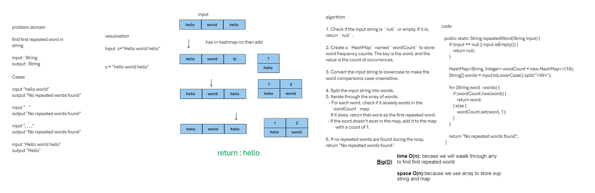

## Code Challenge 31.
### Write a function called repeated word that finds the first word to occur more than once in a string.
## Whiteboard Process


## Approach & Efficiency
The algorithm for the `repeatedWord` method is as follows:

1. Check if the input string is `null` or empty. If it is, return `null`.

2. Create a `HashMap` named `wordCount` to store word frequency counts. The key is the word, and the value is the count of occurrences.

3. Convert the input string to lowercase to make the word comparisons case-insensitive.

4. Split the input string into words using the regular expression "\\W+" as a delimiter. This splits the string into words based on non-word characters (e.g., spaces, punctuation).

5. Iterate through the array of words:
    - For each word, check if it already exists in the `wordCount` map. If it does, return that word as the first repeated word.
    - If the word doesn't exist in the map, add it to the map with a count of 1.

6. If no repeated words are found during the loop, return "No repeated words found."

### Time Complexity:
- Splitting the input string into words takes O(n) time, where 'n' is the length of the input string.
- The loop that iterates through the words runs in O(n) time, as each word is processed once.
- Accessing the `wordCount` `HashMap` and checking for the existence of words is typically an O(1) operation, assuming a good hash function.
- Overall, the time complexity of this method is O(n).

### Space Complexity:
- The space complexity is determined by the space used for storing words in the `wordCount` `HashMap`.
- The `HashMap` will store each unique word in the input string.
- If there are 'm' unique words in the input string, the space complexity is O(m).

In summary, the `repeatedWord` method is designed to find the first repeated word in a string and has a time complexity of O(n) and a space complexity of O(m), where 'n' is the length of the input string and 'm' is the number of unique words in the string.:

## Solution
``` java 
public class WordCounter {
    public static String repeatedWord(String input) {
        if (input == null || input.isEmpty()) {
            return null;
        }

        HashMap<String, Integer> wordCount = new HashMap<>(16);
        String[] words = input.toLowerCase().split("\\W+");

        for (String word : words) {
            if (wordCount.has(word)) {
                return word;
            } else {
                wordCount.set(word, 1);
            }
        }

        return "No repeated words found"; 
    }

    public static void main(String[] args) {
        String input = "The quick brown fox jumps over the lazy dog. The quick brown fox is fast.";
        String result = repeatedWord(input);
        System.out.println("First repeated word: " + result); // Output: "the"
    }
}

``` 
# Tests
``` java
package hashmap;


import org.junit.jupiter.api.Test;

import static org.junit.jupiter.api.Assertions.assertEquals;

public class WordCounterTest {

    @Test
    public void testFirstRepeatedWord1() {
        String input = "Once upon a time, there was a brave princess who...";
        String result = WordCounter.repeatedWord(input);
        assertEquals("a", result);
    }

    @Test
    public void testFirstRepeatedWord2() {
        String input = "It was the best of times, it was the worst of times, it was the age of wisdom, it was the age of foolishness, it was the epoch of belief, it was the epoch of incredulity, it was the season of Light, it was the season of Darkness, it was the spring of hope, it was the winter of despair, we had everything before us, we had nothing before us, we were all going direct to Heaven, we were all going direct the other way – in short, the period was so far like the present period, that some of its noisiest authorities insisted on its being received, for good or for evil, in the superlative degree of comparison only...";
        String result = WordCounter.repeatedWord(input);
        assertEquals("it", result);
    }

    @Test
    public void testFirstRepeatedWord3() {
        String input = "It was a queer, sultry summer, the summer they electrocuted the Rosenbergs, and I didn’t know what I was doing in New York...";
        String result = WordCounter.repeatedWord(input);
        assertEquals("summer", result);
    }
}
```