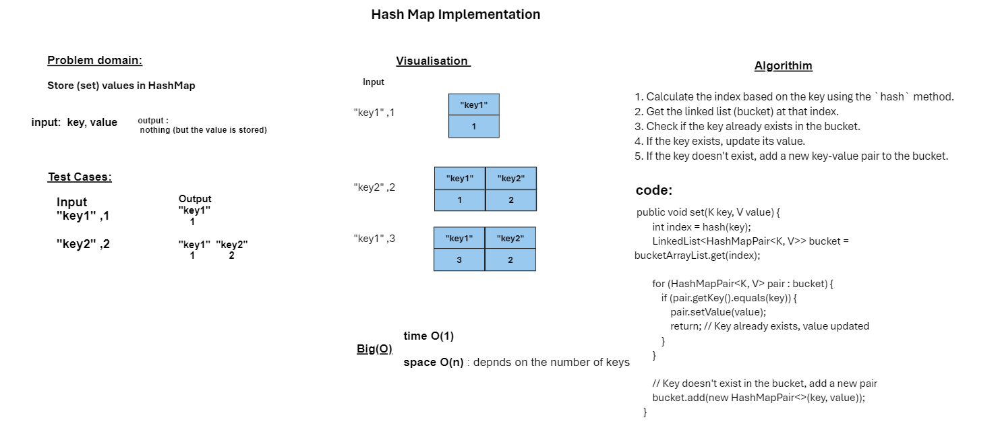

# Code Challenge 30: Hash Table Implementation

## Description of the Challenge

This challenge involves implementing a hash table data structure in Java. A hash table is a data structure that maps keys to values. Keys are hashed into buckets, and values are stored in the buckets. Hash tables are efficient for retrieving values given a key.

The implementation of the hash table should include the following methods:

- `set(key, value)`: Inserts a key-value pair into the hash table. If the key already exists, it should update its value.
- `get(key)`: Returns the value associated with a given key or `null` if the key does not exist in the hash table.
- `has(key)`: Checks if a key exists in the hash table and returns `true` if it does, or `false` if it doesn't.
- `keys()`: Returns a list of all unique keys in the hash table.
- `hash(key)`: Computes the hash for a given key.

## Whiteboard Process


**The time complexity of these methods should be O(1) on average**, assuming a good hash function and a relatively even distribution of keys. In the worst case, when there are many collisions, 

**the space complexity is O(n), where n is the number of keys.**
This challenge will test your ability to implement a fundamental data structure and ensure that it performs efficiently for key-value mapping.


## Code 

```java

package hashmap;

import java.util.ArrayList;
import java.util.LinkedList;
import java.util.List;

// NOTE: Does NOT preserve insertion order!
// WARNING: Don't make K an Object or Character!
public class HashMap<K, V>
{
    ArrayList<LinkedList<HashMapPair<K, V>>> bucketArrayList;  // using ArrayList instead of array so we can instantiate with a parameterized type
    int size;

    public HashMap(int size)
    {
        if (size < 1)
        {
            throw new IllegalArgumentException("HashMap size must be 1 or greater!");
        }

        this.size = size;
        this.bucketArrayList = new ArrayList<>(size);

        // Next part is not required, and is a little inefficient, but it makes writing HashMap operations easier
        for (int i = 0; i < this.size; i++)
        {
            bucketArrayList.add(i, new LinkedList<>());
        }
    }

    // Make sure to replace if the key is a dupe!
    public void set(K key, V value) {
        int index = hash(key);
        LinkedList<HashMapPair<K, V>> bucket = bucketArrayList.get(index);

        for (HashMapPair<K, V> pair : bucket) {
            if (pair.getKey().equals(key)) {
                pair.setValue(value);
                return; // Key already exists, value updated
            }
        }

        // Key doesn't exist in the bucket, add a new pair
        bucket.add(new HashMapPair<>(key, value));
    }

    public V get(K key) {
        int index = hash(key);
        LinkedList<HashMapPair<K, V>> bucket = bucketArrayList.get(index);

        for (HashMapPair<K, V> pair : bucket) {
            if (pair.getKey().equals(key)) {
                return pair.getValue(); // Key found, return its value
            }
        }

        return null; // Key not found
    }

    public boolean has(K key) {
        int index = hash(key);
        LinkedList<HashMapPair<K, V>> bucket = bucketArrayList.get(index);

        for (HashMapPair<K, V> pair : bucket) {
            if (pair.getKey().equals(key)) {
                return true; // Key found
            }
        }

        return false; // Key not found
    }

    public List<K> keys() {
        List<K> keyList = new ArrayList<>();
        for (LinkedList<HashMapPair<K, V>> bucket : bucketArrayList) {
            for (HashMapPair<K, V> pair : bucket) {
                keyList.add(pair.getKey());
            }
        }
        return keyList;
    }


    public int hash(K key)
    {
        return Math.abs(key.hashCode()) % size;
    }
}


```
