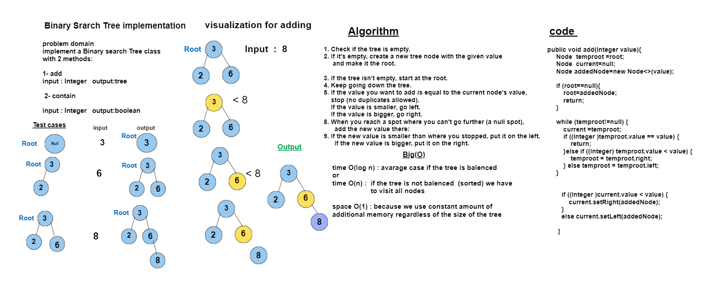

# Code Challenge 15: BinarySearchTree implementation
## Create a new class called BinarySearchTree which is a sub-class of BinaryTree class 


## Whiteboard Process


## Approach & Efficiency
### 1.Add (Integer value) : 
- **Algorithm :** 
1. Check if the tree is empty.
2. If it's empty, create a new tree node with the given value and make it the root.
3. If the tree isn't empty, start at the root.
4. Keep going down the tree.
5. If the value you want to add is equal to the current node's value, stop (no duplicates allowed). 
6. If the value is smaller, go left. 
7. If the value is bigger, go right. 
8. When you reach a spot where you can't go further (a null spot), add the new value there:
9. **If the new value is smaller than where you stopped, put it on the left.** 
10. **If the new value is bigger, put it on the right.**

- **Time Complexity:** O(logn) or O(n)
-  **O(log n)** : average case if the tree is balanced
-  **time O(n)** : **if the tree is not balanced** (sorted) we have to visit all nodes


- **Space Complexity:** O(1)
- The `add` method uses a constant amount of additional memory regardless of the size of the tree.
- It does not create new data structures or allocate additional memory that scales with the number of elements in the tree.
- The space complexity is constant.
## Solution
``` java 
package trees;

import java.util.ArrayList;

public class BinarySearchTree<T extends Comparable <? super T>>extends BinaryTree<T>  {


    public BinarySearchTree() {
        super();
    }


    public boolean Contains(Integer value){
     Node  temproot =root;
     while (temproot!=null) {
         if (temproot.value == value) {
             return true;
         } else if ((Integer) temproot.value < value) {
             temproot = temproot.right;
         } else temproot = temproot.left;
     }
     return false; }
     
  public void add (Integer value){
     Node  temproot =root;
     Node  current=null;
     Node addedNode=new Node<>(value);

     if (root==null){
         root=addedNode;
         return;
     }

     while (temproot!=null) {
         current =temproot;
         if ((Integer )temproot.value == value) {
             return;
         }else if ((Integer) temproot.value < value) {
             temproot = temproot.right;
         } else temproot = temproot.left;
     }

        
        if ((Integer )current.value < value) {
            current.setRight(addedNode);
        }
        else current.setLeft(addedNode);

      }


}
 ``` 


# Tests
``` java
package trees;

import org.junit.jupiter.api.BeforeEach;
import org.junit.jupiter.api.Test;

import static org.junit.jupiter.api.Assertions.*;

public class BinarySearchTreeTest {
    private BinarySearchTree<Integer> binarySearchTree;

    @BeforeEach
    public void setUp() {
        binarySearchTree = new BinarySearchTree<>();
        // Create a sample binary search tree:
        //       3
        //      / \
        //     1   5
        //    / \
        //   0   2
        binarySearchTree.Add(3);
        binarySearchTree.Add(1);
        binarySearchTree.Add(5);
        binarySearchTree.Add(0);
        binarySearchTree.Add(2);
    }

    @Test
    public void testContains() {
        assertTrue(binarySearchTree.Contains(3));
        assertTrue(binarySearchTree.Contains(0));
        assertTrue(binarySearchTree.Contains(5));
        assertFalse(binarySearchTree.Contains(4));
    }

    @Test
    public void testAdd() {
        assertFalse(binarySearchTree.Contains(4));
        binarySearchTree.Add(4);
        assertTrue(binarySearchTree.Contains(4));
    }

    @Test
    public void testAddExistingValue() {
        assertTrue(binarySearchTree.Contains(2));
        // Adding an existing value should not change the tree
        binarySearchTree.Add(2);
        assertTrue(binarySearchTree.Contains(2));
    }
}

```