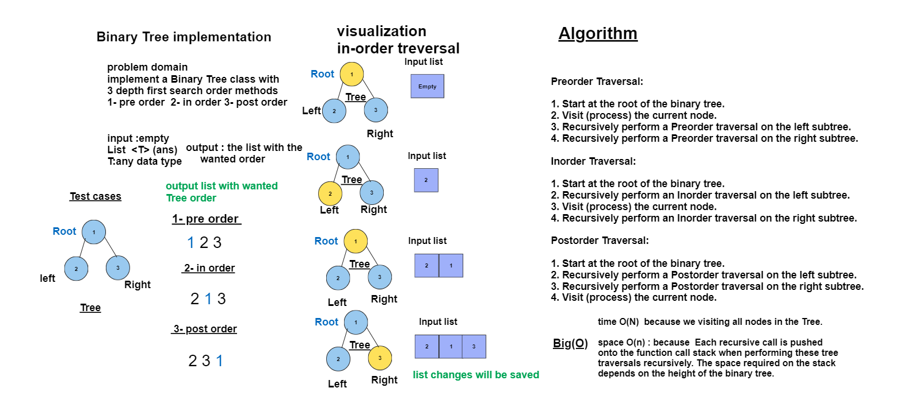

# Code Challenge 15: BinaryTree implementation
## Create a new class called BinaryTree  with 3 depth first search order methods
## 1. pre order
## 2.  in order
## 3.  post order 

## Whiteboard Process


## Approach & Efficiency
## there are 3 main methods
### 1.preOrderTraversal (Node node , List<T> answer) : 
- **Algorithm :**

1. Start at the root of the binary tree.
2. Visit (process) the current node.
3. Recursively perform a Preorder traversal on the left subtree.
4. Recursively perform a Preorder traversal on the right subtree.

 ### 2. inOrderTraversal (Node node , List<T> answer):

1. Start at the root of the binary tree.
2. Recursively perform an Inorder traversal on the left subtree.
3. Visit (process) the current node.
4. Recursively perform an Inorder traversal on the right subtree.

### 3. postOrderTraversal (Node node , List<T> answer):

1. Start at the root of the binary tree.
2. Recursively perform a Postorder traversal on the left subtree.
3. Recursively perform a Postorder traversal on the right subtree.
4. Visit (process) the current node.


- ## **Time Complexity:** O(n) :because we are visiting all nodes in the Tree.


- ## **Space Complexity:** O(n)
- because  Each recursive call is pushed onto the function call stack when performing these tree traversals recursively. 
- The space required in the  call stack depends on the height of the binary tree.

## Solution
``` java 
package trees;

import java.util.ArrayList;
import java.util.List;

public class BinaryTree<T> {
    public Node<T>root;
   


    public BinaryTree() {
        root=null;
    }

    private void preOrderTraversal (Node node , List<T> answer){
        if(node==null){
            return ;
        }
        else { answer.add((T) node.value);
            preOrderTraversal(node.left , answer);
            preOrderTraversal(node.right , answer);
        }
    }
    public void preOrderTraversal ( List<T> answer){
        preOrderTraversal(root,answer);
    }
    private void inOrderTraversal (Node node , List<T> answer){
        if(node==null){
            return ;
        }
        else {
            inOrderTraversal(node.left , answer);
            answer.add((T) node.value);
            inOrderTraversal(node.right , answer);
        }
    }
    public void inOrderTraversal ( List<T> answer){
        inOrderTraversal(root,answer);
    }
    private void postOrderTraversal (Node node , List<T> answer){
        if(node==null){
            return ;
        }
        else {
            postOrderTraversal(node.left , answer);
            postOrderTraversal(node.right , answer);
            answer.add((T) node.value);
        }
    }
    
 } 
 ``` 

``` java  
 
 package trees;

public class Node <T>{
  public   T value;
 public    Node left;
 public    Node right;

    public Node (T value){
        this.value=value;
        this.left=null;
        this.right=null;

    }

    public T getValue() {
        return value;
    }

    public void setValue(T value) {
        this.value = value;
    }

    public Node<T> getLeft() {
        return left;
    }

    public void setLeft(Node<T> left) {
        this.left = left;
    }

    public Node<T> getRight() {
        return right;
    }

    public void setRight(Node<T> right) {
        this.right = right;
    }
}

``` 
# Tests
``` java
package trees;

import org.junit.jupiter.api.BeforeEach;
import org.junit.jupiter.api.Test;

import java.util.ArrayList;
import java.util.List;

import static org.junit.jupiter.api.Assertions.assertEquals;

public class BinaryTreeTest {
    private BinaryTree<Integer> binaryTree;

    @BeforeEach
    public void setUp() {
        binaryTree = new BinaryTree<>();
        // Create a sample binary tree:
        //       1
        //      / \
        //     2   3
        //    / \
        //   4   5
        binaryTree.root = new Node<>(1);
        binaryTree.root.left = new Node<>(2);
        binaryTree.root.right = new Node<>(3);
        binaryTree.root.left.left = new Node<>(4);
        binaryTree.root.left.right = new Node<>(5);
    }

    @Test
    public void testPreOrderTraversal() {
        List<Integer> result = new ArrayList<>();
        binaryTree.preOrderTraversal(result);
        List<Integer> expected = List.of(1, 2, 4, 5, 3);
        assertEquals(expected, result);
    }

    @Test
    public void testInOrderTraversal() {
        List<Integer> result = new ArrayList<>();
        binaryTree.inOrderTraversal(result);
        List<Integer> expected = List.of(4, 2, 5, 1, 3);
        assertEquals(expected, result);
    }

    @Test
    public void testPostOrderTraversal() {
        List<Integer> result = new ArrayList<>();
        binaryTree.postOrderTraversal(result);
        List<Integer> expected = List.of(4, 5, 2, 3, 1);
        assertEquals(expected, result);
    }


}


```