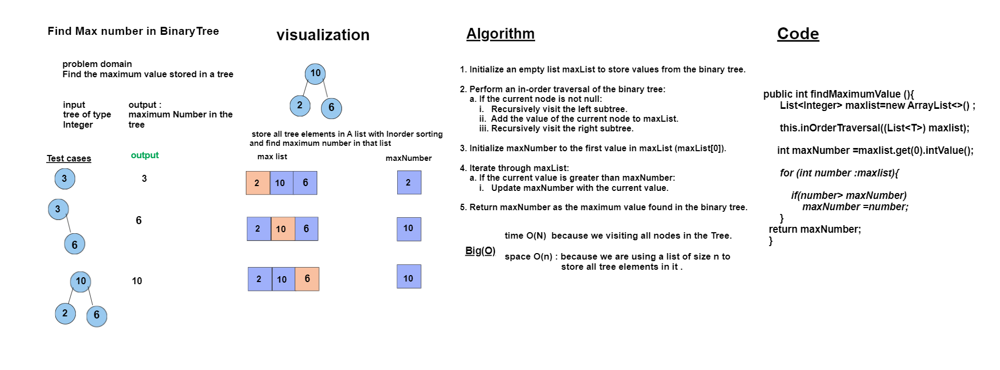

# Code Challenge 16:
## Find the maximum value stored in a tree


## Whiteboard Process


## Approach & Efficiency

1. Initialize an empty list maxList to store values from the binary tree.


2. **Perform an in-order traversal of the binary tree**:
 - If the current node is not null:
   - Recursively visit the left subtree.
   - Add the value of the current node to maxList.
   - Recursively visit the right subtree.

3. Initialize maxNumber to the first value in maxList (maxList[0]).

4. **Iterate through maxList**:
    - If the current value is greater than maxNumber:
    - Update maxNumber with the current value.
     

5. **Return maxNumber as the maximum value found in the binary tree**.


- ## **Time Complexity:** O(n) :because we are visiting all nodes in the Tree.


- ## **Space Complexity:** O(n)
- because  we are using a list of size n to store all tree elements in it . 
- The space required  depends on the height of the binary tree.

## Solution
``` java 
package trees;

import java.util.ArrayList;
import java.util.List;

public class BinaryTree<T> {
    public Node<T>root;
   


    public BinaryTree() {
        root=null;
    }

    private void inOrderTraversal (Node node , List<T> answer){
        if(node==null){
            return ;
        }
        else {
            inOrderTraversal(node.left , answer);
            answer.add((T) node.value);
            inOrderTraversal(node.right , answer);
        }
    }
    public void inOrderTraversal ( List<T> answer){
        inOrderTraversal(root,answer);
    }
     
      public int findMaximumValue (){
        List<Integer> maxlist=new ArrayList<>() ;

        this.inOrderTraversal((List<T>) maxlist);
       int maxNumber =maxlist.get(0).intValue();
        for (int number :maxlist){
            if(number> maxNumber)
                maxNumber =number;
        }
    return maxNumber;
    }

    
 ``` 

``` java  
 
 package trees;

public class Node <T>{
  public   T value;
 public    Node left;
 public    Node right;

    public Node (T value){
        this.value=value;
        this.left=null;
        this.right=null;

    }

    public T getValue() {
        return value;
    }

    public void setValue(T value) {
        this.value = value;
    }

    public Node<T> getLeft() {
        return left;
    }

    public void setLeft(Node<T> left) {
        this.left = left;
    }

    public Node<T> getRight() {
        return right;
    }

    public void setRight(Node<T> right) {
        this.right = right;
    }
}

``` 
# Tests
``` java
package trees;

import org.junit.jupiter.api.BeforeEach;
import org.junit.jupiter.api.Test;

import java.util.ArrayList;
import java.util.List;

import static org.junit.jupiter.api.Assertions.assertEquals;

public class BinaryTreeTest {
    private BinaryTree<Integer> binaryTree;

    @BeforeEach
    public void setUp() {
        binaryTree = new BinaryTree<>();
        // Create a sample binary tree:
        //       1
        //      / \
        //     2   3
        //    / \
        //   4   5
        binaryTree.root = new Node<>(1);
        binaryTree.root.left = new Node<>(2);
        binaryTree.root.right = new Node<>(3);
        binaryTree.root.left.left = new Node<>(4);
        binaryTree.root.left.right = new Node<>(5);
    }

      @Test
    public void testFindMaximumValue(){
      int result= binaryTree.findMaximumValue();
      int expected =5;
      assertEquals(expected,result);
    }
    

}


```