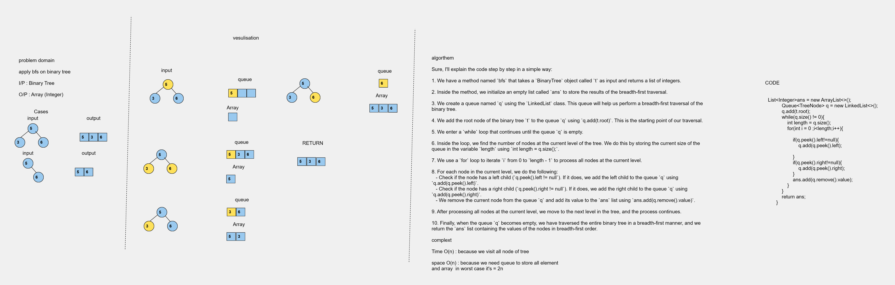

# Code Challenge 17:
## Apply Breadth First Search


## Whiteboard Process


## Approach & Efficiency

1. We have a method named `bfs` that takes a `BinaryTree` object called `t` as input and returns a list of integers.

2. Inside the method, we initialize an empty list called `ans` to store the results of the breadth-first traversal.

3. We create a queue named `q` using the `LinkedList` class. This queue will help us perform a breadth-first traversal of the binary tree.

4. We add the root node of the binary tree `t` to the queue `q` using `q.add(t.root)`. This is the starting point of our traversal.

5. We enter a `while` loop that continues until the queue `q` is empty.

6. Inside the loop, we find the number of nodes at the current level of the tree. We do this by storing the current size of the queue in the variable `length` using `int length = q.size();`.

7. We use a `for` loop to iterate `i` from 0 to `length - 1` to process all nodes at the current level.

8. For each node in the current level, we do the following:
   - Check if the node has a left child (`q.peek().left != null`). If it does, we add the left child to the queue `q` using `q.add(q.peek().left)`.
   - Check if the node has a right child (`q.peek().right != null`). If it does, we add the right child to the queue `q` using `q.add(q.peek().right)`.
   - We remove the current node from the queue `q` and add its value to the `ans` list using `ans.add(q.remove().value)`.

9. After processing all nodes at the current level, we move to the next level in the tree, and the process continues.

10. Finally, when the queue `q` becomes empty, we have traversed the entire binary tree in a breadth-first manner, and we return the `ans` list containing the values of the nodes in breadth-first order.


### Big O space/time
* Time Complexity  O(n)
* Space Complexity O(N)
## Solution
``` java 
package trees;

import java.util.ArrayList;
import java.util.List;

public class BinaryTree<T> {
    public Node<T>root;
   


    public BinaryTree() {
        root=null;
    }

  public static   List<Integer> bfs(BinaryTree t){
        List<Integer>ans = new ArrayList<>();
        Queue<Node> q = new LinkedList<>();
        q.add(t.root);
        while(q.size() != 0){
            int length = q.size();
            for(int i = 0 ;i<length;i++){

                if(q.peek().left!=null){
                    q.add(q.peek().left);

                }
                if(q.peek().right!=null){
                    q.add(q.peek().right);
                }
                ans.add((Integer) q.remove().value);
            }
        }
        return ans;
    }

    
 ``` 

``` java  
 
 package trees;

public class Node <T>{
  public   T value;
 public    Node left;
 public    Node right;

    public Node (T value){
        this.value=value;
        this.left=null;
        this.right=null;

    }

    public T getValue() {
        return value;
    }

    public void setValue(T value) {
        this.value = value;
    }

    public Node<T> getLeft() {
        return left;
    }

    public void setLeft(Node<T> left) {
        this.left = left;
    }

    public Node<T> getRight() {
        return right;
    }

    public void setRight(Node<T> right) {
        this.right = right;
    }
}

``` 
# Tests
``` java
package trees;

import org.junit.jupiter.api.BeforeEach;
import org.junit.jupiter.api.Test;

import java.util.ArrayList;
import java.util.List;

import static org.junit.jupiter.api.Assertions.assertEquals;

public class BinaryTreeTest {
    private BinaryTree<Integer> binaryTree;

    @BeforeEach
    public void setUp() {
        binaryTree = new BinaryTree<>();
        // Create a sample binary tree:
        //       1
        //      / \
        //     2   3
        //    / \
        //   4   5
        binaryTree.root = new Node<>(1);
        binaryTree.root.left = new Node<>(2);
        binaryTree.root.right = new Node<>(3);
        binaryTree.root.left.left = new Node<>(4);
        binaryTree.root.left.right = new Node<>(5);
    }

     @Test
    public void testBFS() {

        // Perform BFS and get the result
        List<Integer> result = BinaryTree.bfs(binaryTree);

        // Define your expected result
        List<Integer> expected = List.of(1, 2, 3, 4, 5);

        assertEquals(expected, result);
    }

}


```