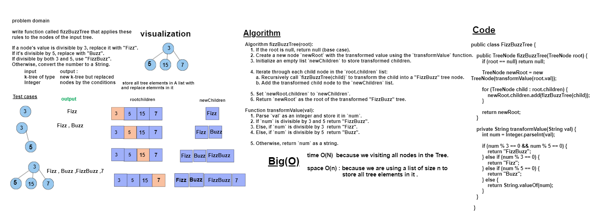

# Code Challenge 18:FizzBuzzTree
The challenge requires creating a new k-ary tree with modified values based on specific rules.
write function called fizzBuzzTree that applies these rules to the nodes of the input tree.

If a node's value is divisible by 3, replace it with "Fizz".

If it's divisible by 5, replace with "Buzz".

If divisible by both 3 and 5, use "FizzBuzz". 

Otherwise, convert the number to a String.


## Whiteboard Process


## Approach & Efficiency
Algorithm fizzBuzzTree(root):
1. If the root is null, return null (base case).
2. Create a new node `newRoot` with the transformed value using the `transformValue` function.
3. Initialize an empty list `newChildren` to store transformed children.
4. Iterate through each child node in the `root.children` list:
   - Recursively call `fizzBuzzTree(child)` to transform the child into a "FizzBuzz" tree node.
   - Add the transformed child node to the `newChildren` list.
5. Set `newRoot.children` to `newChildren`.
6. Return `newRoot` as the root of the transformed "FizzBuzz" tree.

Function transformValue(val):
1. Parse `val` as an integer and store it in `num`.
2. If `num` is divisible by 3 and 5  return "FizzBuzz".
3. Else, if `num` is divisible by 3  return "Fizz".
4. Else, if `num` is divisible by 5 return "Buzz".
5. Otherwise, return `num` as a string.


### Big O space/time
* Time Complexity  O(n)
* Space Complexity O(N)
## Solution
``` java 
package trees;

import java.util.ArrayList;
import java.util.List;
class TreeNode {
    String val;
    List<TreeNode> children;

    public TreeNode(String val) {
        this.val = val;
        this.children = new ArrayList<>();
    }
}

public class FizzBuzzTree {

    public TreeNode fizzBuzzTree(TreeNode root) {
        if (root == null) return null;

        TreeNode newRoot = new TreeNode(transformValue(root.val));

        for (TreeNode child : root.children) {
            newRoot.children.add(fizzBuzzTree(child));
        }

        return newRoot;
    }

    private String transformValue(String val) {
        int num = Integer.parseInt(val);

        if (num % 3 == 0 && num % 5 == 0) {
            return "FizzBuzz";
        } else if (num % 3 == 0) {
            return "Fizz";
        } else if (num % 5 == 0) {
            return "Buzz";
        } else {
            return String.valueOf(num);
        }
    }    }
 ``` 


# Tests
``` java
package trees;

import org.junit.jupiter.api.Test;
import static org.junit.jupiter.api.Assertions.*;

 public class FizzBuzzTreeTest {

    @Test
    public void testFizzBuzzTree() {
        TreeNode node1 = new TreeNode("3");
        TreeNode node2 = new TreeNode("5");
        TreeNode node3 = new TreeNode("15");
        TreeNode node4 = new TreeNode("7");

        node1.children.add(node2);
        node1.children.add(node3);
        node1.children.add(node4);
        FizzBuzzTree fizzBuzzTree = new FizzBuzzTree();
        TreeNode newRoot = fizzBuzzTree.fizzBuzzTree(node1);

        String expectedOutput = "Fizz BuzzFizzBuzz7";

        String actualOutput = treeToString(newRoot);

        assertEquals(expectedOutput, actualOutput);
    }
    private String treeToString(TreeNode root) {
        if (root == null) return "";
        StringBuilder result = new StringBuilder(root.val + " ");
        for (TreeNode child : root.children) {
            result.append(treeToString(child));
        }
        return result.toString().trim();
    }

}


```