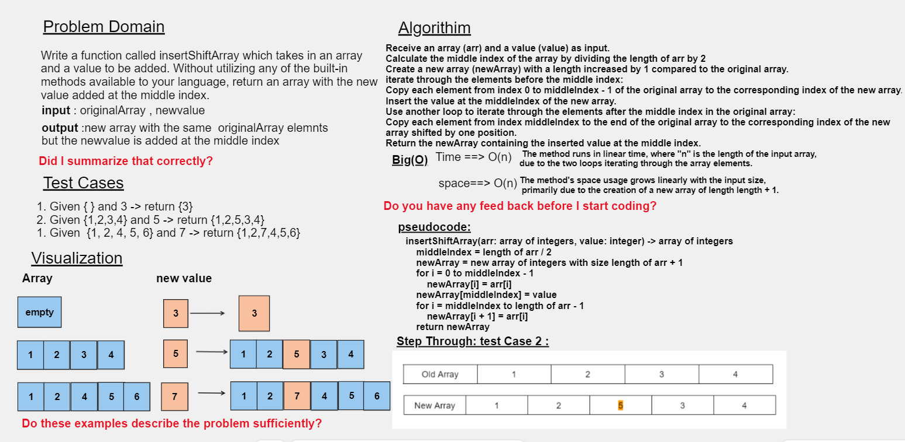

# Code Challenge: Class 02
#### Write a function called insertShiftArray which takes in an array and a value to be added. Without utilizing any of the built-in methods available to your language, return an array with the new value added at the middle index. 
## Whiteboard Process



## Approach & Efficiency
Approach for `insertShiftArr` method:

1. Calculate the middle index of the input array.
2. Create a new array with a length increased by 1 to accommodate the inserted value.
3. Copy elements from the original array before the middle index into the new array.
4. Insert the value at the middle index of the new array.
5. Copy elements from the original array after the middle index into the new array shifted by one position.
6. Return the new array containing the inserted value at the middle index.

Efficiency:
The approach involves two loops: one to copy elements before the middle index and another to copy elements after the middle index. The time complexity is O(n), where "n" is the length of the input array, due to the linear iteration through the array elements. The space complexity is also O(n), primarily due to the creation of the new array.

Reasoning:
This approach efficiently inserts a value into an array at the middle index by dividing the array copying task into two separate loops, allowing for a straightforward and clear implementation while maintaining a linear time complexity.

### Time Complexity:
The time complexity of the insertShiftArray function is O(n).

### Space Complexity:
The space complexity of the insertShiftArray function is also O(n). 


## Solution 
``` java 
public class insertShiftArray {

   
        public static int[] insertShiftArr(int[] arr, int value) {
            int length = arr.length;
            int[] newArray = new int[length + 1];
            int middleIndex = length / 2;
    
            for (int i = 0; i < middleIndex; i++) {
                newArray[i] = arr[i];
            }
    
            newArray[middleIndex] = value;
    
            for (int i = middleIndex; i < length; i++) {
                newArray[i + 1] = arr[i];
            }
    
            return newArray;
        }
    
        public static void main(String[] args) {
            int[] originalArray = {1, 2, 4, 5, 6,7,8};
            int newValue = 6;
    
            int[] newArray = insertShiftArr(originalArray, newValue);
    
            System.out.print("Original array: ");
            for (int num : originalArray) {
                System.out.print(num + " ");
            }
    
            System.out.println();
    
            System.out.print("New array with inserted value: ");
            for (int num : newArray) {
                System.out.print(num + " ");
            }
        }
    }
    
```
