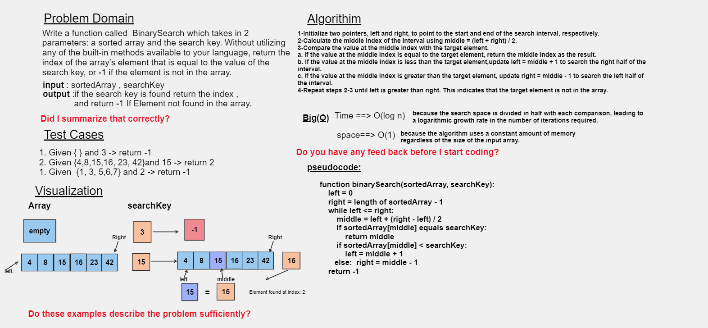

# Code Challenge: Class 03
#### Write a function called BinarySearch which takes in 2 parameters: a sorted array and the search key. Without utilizing any of the built-in methods available to your language, return the index of the array’s element that is equal to the value of the search key, or -1 if the element is not in the array.
## Whiteboard Process



## Approach & Efficiency
ere's the algorithm for binary search:

Initialize two pointers, left and right, to point to the start and end of the search interval, respectively.

Calculate the middle index of the interval using middle = (left + right) / 2.

Compare the value at the middle index with the target element.

a. If the value at the middle index is equal to the target element, return the middle index as the result.

b. If the value at the middle index is less than the target element, update left = middle + 1 to search the right half of the interval.

c. If the value at the middle index is greater than the target element, update right = middle - 1 to search the left half of the interval.

Repeat steps 2-3 until left is greater than right. This indicates that the target element is not in the array.
Efficiency:
Binary Search: O(log n), where n is the number of elements in the sorted array.
Space Complexity:

Binary Search: O(1), constant space complexity. The algorithm uses a few variables for indices and comparisons, but the memory usage does not increase with the size of the input array.
Binary search is an efficient algorithm with both logarithmic time complexity and constant space complexity, making it suitable for searching in large sorted arrays while using minimal memory.

### Time Complexity:
Binary Search: O(log n), where n is the number of elements in the sorted array.
### Space Complexity:
Binary Search: O(1), constant space complexity. The algorithm uses a few variables for indices and comparisons, but the memory usage does not increase with the size of the input array.


## Solution 
``` java 
public class BinarySearch {

    public static int binarySearch(int[] sortedArray, int searchKey) {
        int left = 0;
        int right = sortedArray.length - 1;

        while (left <= right) {
            int middle = left + (right - left) / 2;

            if (sortedArray[middle] == searchKey) {
                return middle;
            }

            if (sortedArray[middle] < searchKey) {
                left = middle + 1;
            } else {
                right = middle - 1;
            }
        }

        return -1;
    }

    public static void main(String[] args) {
        int[] sortedArray = {};
        int searchKey = 10;

        int index = binarySearch(sortedArray, searchKey);

        if (index != -1) {
            System.out.println("Element found at index: " + index);
        } else {
            System.out.println("Element not found in the array.");
        }
    }
}

    
```
