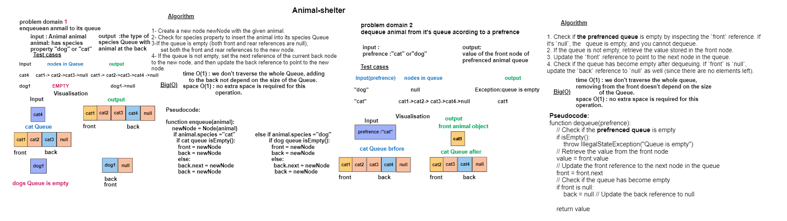

## Code Challenge 12: AnimalShelter
### Create a class called AnimalShelter which holds only dogs and cats. the class works as Queue data structure.
## Whiteboard Process


## Approach & Efficiency
## there are 2 main methods 
### 1. enqueue(animal) : method inserts a new element (animal) at the back (or rear) of its species queue.
- **Algorithm :**
1. Create a new node `newNode` with the given `animal`.
2. Check for `species` property to insert the `animal` into its species Queue  
3. If the queue is empty (both front and rear references are null), set
   both the front and rear references to the new node.
4. If the queue is not empty, set the next reference of the current back
   node to the new node, and then update the back reference to point to
   the new node.
   
- **Time Complexity:** O(1)
    - The `enqueue` method inserts a new element (node) at the back (or rear) of the queue.
    - Regardless of the number of elements currently in the queue, the `enqueue` operation takes a constant amount of time because it involves creating a new node, setting its `next` reference to the current back node, and updating the `back` reference to the new node.
    - The time complexity is not dependent on the size of the queue.
  

- **Space Complexity:** O(1)
    - The `enqueue` method uses a constant amount of additional memory regardless of the size of the queue.
    - It creates a single new node for the element being enqueued, and the memory usage does not depend on the number of elements already in the queue.
    - The space complexity is constant.

### 2. dequeue(pref) : removes and returns Return: either a dog or a cat, based on preference from of its species queue .
- **Algorithm :**
1. Check if the queue is empty by inspecting the `front` reference. If it's `null`, the
   queue is empty, and you cannot dequeue.
2. Check for `species` property to remove `animal` from its species Queue
2. If the queue is not empty, retrieve the value stored in the front node.
3. Update the `front` reference to point to the next node in the queue.
4. Check if the queue has become empty after dequeuing. If `front` is `null`, update the `back` reference to `null` as well (since there are no elements left).

- **Time Complexity:** O(1)
    - The `dequeue` method removes and returns the element from the front of the queue.
    - Regardless of the number of elements currently in the queue, the `dequeue` operation takes a constant amount of time because it involves updating the `front` reference to point to the next node.
    - The time complexity is not dependent on the size of the queue.


- **Space Complexity:** O(1)
    - The `dequeue` method uses a constant amount of additional memory regardless of the size of the queue.
    - It does not create new data structures or allocate additional memory that scales with the number of elements in the queue.
    - The space complexity is constant.

## Solution
``` java 
package queue;

public class Animal {
    String species;
    String name;

    public Animal(String species, String name) {
        this.species = species;
        this.name = name;
    }

    public String getSpecies() {
        return species;
    }

    public String getName() {
        return name;
    }
}

package queue;

public class AnimalShelter  {

    public AnimalShelter(){

    }

    private Queue catQueue =new Queue<>();

    private Queue dogQueue =new Queue<>();
    public Queue getCatQueue() {
        return catQueue;
    }

    public Queue getDogQueue() {
        return dogQueue;
    }


    public void enqueue( Animal animal) {
        if(animal.species =="cat"){
            this.catQueue.enqueue(animal);
        }else if(animal.species =="dog"){
            this.dogQueue.enqueue(animal); }


    }

    public Animal dequeue(String pref ){
        if (pref == "cat" && !catQueue.isEmpty())
            return (Animal) catQueue.dequeue();
        else if (pref == "dog" && !dogQueue.isEmpty())
            return (Animal) dogQueue.dequeue();
            return null;
    }


}
``` 

# Tests
``` java
cpackage testing;
import static org.junit.jupiter.api.Assertions.*;
import org.junit.jupiter.api.BeforeEach;
import org.junit.jupiter.api.Test;
import queue.Animal;
import queue.AnimalShelter;


public class AnimalShelterTest {

    private AnimalShelter shelter;


    @BeforeEach
    public void setUp() {
        shelter = new AnimalShelter();
    }

    @Test
    public void testEnqueueAndDequeueCat() {
        Animal cat1 = new Animal("cat", "Whiskers");
        Animal cat2 = new Animal("cat", "Mittens");
        Animal dog1 = new Animal("dog", "Fido");

        shelter.enqueue(cat1);
        shelter.enqueue(cat2);
        shelter.enqueue(dog1);

        assertEquals("Whiskers", shelter.dequeue("cat").getName());
        assertEquals("Mittens", shelter.dequeue("cat").getName());
    }

    @Test
    public void testEnqueueAndDequeueDog() {
        Animal cat1 = new Animal("cat", "Fluffy");
        Animal dog1 = new Animal("dog", "Rex");
        Animal dog2 = new Animal("dog", "Buddy");

        shelter.enqueue(cat1);
        shelter.enqueue(dog1);
        shelter.enqueue(dog2);

        assertEquals("Rex", shelter.dequeue("dog").getName());
        assertEquals("Buddy", shelter.dequeue("dog").getName());
    }

    @Test
    public void testDequeueEmptyShelter() {
        assertNull(shelter.dequeue("cat"));
        assertNull(shelter.dequeue("dog"));
    }
}


```