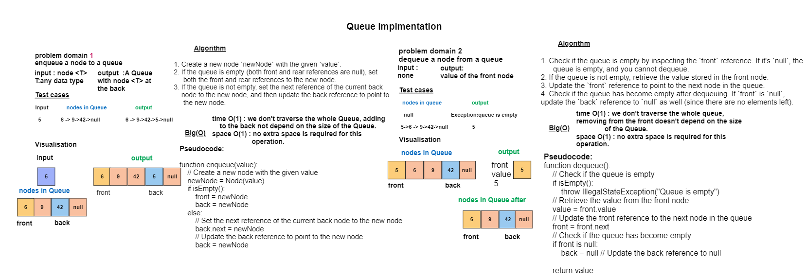

## Code Challenge 11: PseudoQueue
## Create a new class called pseudo queue which implemnts a Queue Using 2 Stacks.
## Whiteboard Process


## Approach & Efficiency
## there are 2 main methods
## Approach & Efficiency
## there are 2 main methods
### 1. enqueue(T value) : method inserts a new element (node) at the back (or rear) of the queue.
- **Algorithm :**
1. Create a new node `newNode` with the given `value`.
2. If the queue is empty (both front and rear references are null), set
   both the front and rear references to the new node.
3. If the queue is not empty, set the next reference of the current back
   node to the new node, and then update the back reference to point to
   the new node.

- **Time Complexity:** O(1)
    - The `enqueue` method inserts a new element (node) at the back (or rear) of the queue.
    - Regardless of the number of elements currently in the queue, the `enqueue` operation takes a constant amount of time because it involves creating a new node, setting its `next` reference to the current back node, and updating the `back` reference to the new node.
    - The time complexity is not dependent on the size of the queue.


- **Space Complexity:** O(1)
    - The `enqueue` method uses a constant amount of additional memory regardless of the size of the queue.
    - It creates a single new node for the element being enqueued, and the memory usage does not depend on the number of elements already in the queue.
    - The space complexity is constant.

### 2. dequeue() : removes and returns the element from the front of the queue.
- **Algorithm :**
1. Check if the queue is empty by inspecting the `front` reference. If it's `null`, the
   queue is empty, and you cannot dequeue.
2. If the queue is not empty, retrieve the value stored in the front node.
3. Update the `front` reference to point to the next node in the queue.
4. Check if the queue has become empty after dequeuing. If `front` is `null`, update the `back` reference to `null` as well (since there are no elements left).

- **Time Complexity:** O(1)
    - The `dequeue` method removes and returns the element from the front of the queue.
    - Regardless of the number of elements currently in the queue, the `dequeue` operation takes a constant amount of time because it involves updating the `front` reference to point to the next node.
    - The time complexity is not dependent on the size of the queue.


- **Space Complexity:** O(1)
    - The `dequeue` method uses a constant amount of additional memory regardless of the size of the queue.
    - It does not create new data structures or allocate additional memory that scales with the number of elements in the queue.
    - The space complexity is constant.

## Solution
``` java 
package queue;

public interface Queueable <T> {
    void enqueue(T value);
    T dequeue();
    T peek();

}

package queue;

import stack.Stack;

public class PseudoQueue<T> implements Queueable{
    int size =0;

    Stack s1=new Stack();
    Stack s2=new Stack();


    @Override
    public void enqueue(Object value) {


      if(!s2.isEmpty()) {
          while (s2.top != null) {
              s1.push(s2.pop());
          }
      } s1.push(value);

    }

    @Override
    public Object dequeue() {

        Object dequeued=null;

        if(!s1.isEmpty()){
            while (s1.top !=null){
                s2.push(s1.pop());
            }
           } dequeued= s2.pop();
   return dequeued; }

    @Override
    public Object peek() {
        Object peeked=null;
        if(!s1.isEmpty()){
            while (s1.top !=null){
                s2.push(s1.pop());
            }
        } peeked= s2.top.value;
        return peeked;
    }

    public boolean isEmpity (){
        return (s1.isEmpty() && s2.isEmpty());
    }

}


``` 
# Tests
``` java
public class PseudoQueueTest {

    private PseudoQueue<Integer> queue;

    @BeforeEach
    public void setUp() {
        queue = new PseudoQueue<>();
    }

    @Test
    public void testEnqueueAndDequeue() {
        queue.enqueue(1);
        queue.enqueue(2);
        queue.enqueue(3);

        assertEquals(1, queue.dequeue());
        assertEquals(2, queue.dequeue());
        assertEquals(3, queue.dequeue());
        assertTrue(queue.isEmpity());
    }

    @Test
    public void testPeek() {
        queue.enqueue(42);
        queue.enqueue(17);

        assertEquals(42, queue.peek());
        assertEquals(42, queue.peek()); // Peek should not remove the element
        assertFalse(queue.isEmpity());
    }

    @Test
    public void testIsEmpty() {
        assertTrue(queue.isEmpity());

        queue.enqueue(5);
        assertFalse(queue.isEmpity());

        queue.dequeue();
        assertTrue(queue.isEmpity());
    }

    @Test
    public void testEnqueueAndDequeueMixed() {
        queue.enqueue(1);
        queue.enqueue(2);
        assertEquals(1, queue.dequeue());
        queue.enqueue(3);
        assertEquals(2, queue.dequeue());
        assertEquals(3, queue.dequeue());
        assertTrue(queue.isEmpity());
    }


    }
```