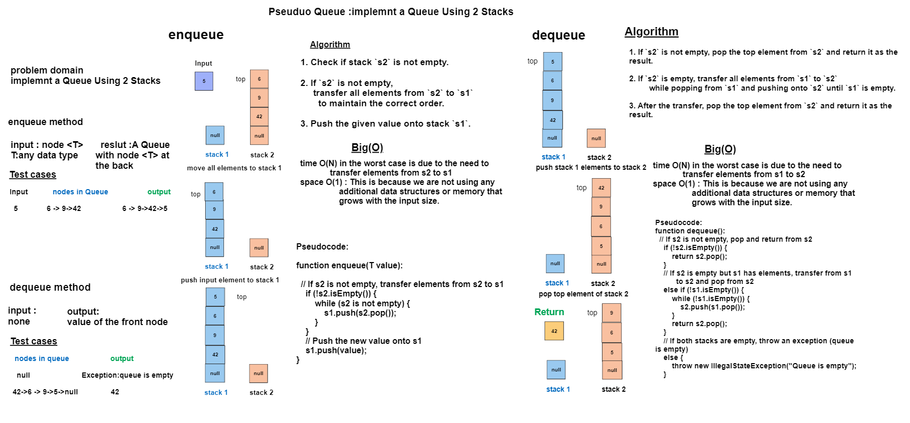

## Code Challenge 11: PseudoQueue
## Create a new class called pseudo queue which implemnts a Queue Using 2 Stacks.
## Whiteboard Process


## Approach & Efficiency
## there are 2 main methods
### 1. enqueue(T value) : method inserts a new element (node) at the back (or rear) of the queue but now in a different way .
- **Algorithm :**

1. Check if stack `s2` is not empty.

2. If `s2` is not empty,
   transfer all elements from `s2` to `s1`
   to maintain the correct order.

3. Push the given value onto stack `s1`.


- **Time Complexity:** O(n)
    - In the worst case, when we need to transfer elements from `s2` to `s1`, the time complexity is O(N), where N is the number of elements in `s2`. 
    - This is because we are popping all elements from `s2` and pushing them onto `s1`, which takes linear time in the number of elements in `s2`.
    - If `s2` is empty (which is the best-case scenario), the time complexity is O(1) because we only need to push the given value onto `s1`.


- **Space Complexity:** O(1)
    - The `enqueue` method uses a constant amount of additional memory regardless of whether `s2` is empty or not. 
    - This is because we are not using any additional data structures or memory that grows with the input size. 
    - We are simply performing operations on the existing stacks `s1` and `s2`.

### 2. dequeue() : removes and returns the element from the front of the queue but now in a different way.
- **Algorithm :**
1. If `s2` is not empty, pop the top element from `s2` and return it as the result.

2. If `s2` is empty, transfer all elements from `s1` to `s2`  
   while popping from `s1` and pushing onto `s2` until `s1` is empty.

3. After the transfer, pop the top element from `s2` and return it as the result.


- **Time Complexity:**
  - In the worst case, when s2 is empty and we need to transfer elements from s1 to s2, the time complexity is O(N), where N is the number of elements in s1. This is because we are popping all elements from s1 and pushing them onto s2, which takes linear time in the number of elements in s1.
  - If s2 is not empty (best-case scenario), the time complexity is O(1) because we are simply popping an element from s2


- **Space Complexity:** O(1)
    - The space complexity of the dequeue operation is O(1) 
    - because we are not using any additional data structures or memory that grows with the input size.
    - We are only performing operations on the existing stacks s1 and s2.

## Solution
``` java 
package queue;

public interface Queueable <T> {
    void enqueue(T value);
    T dequeue();
    T peek();

}

package queue;

import stack.Stack;

public class PseudoQueue<T> implements Queueable{
    int size =0;

    Stack s1=new Stack();
    Stack s2=new Stack();


    @Override
    public void enqueue(Object value) {


      if(!s2.isEmpty()) {
          while (s2.top != null) {
              s1.push(s2.pop());
          }
      } s1.push(value);

    }

    @Override
    public Object dequeue() {

        Object dequeued=null;

        if(!s1.isEmpty()){
            while (s1.top !=null){
                s2.push(s1.pop());
            }
           } dequeued= s2.pop();
   return dequeued; }

    @Override
    public Object peek() {
        Object peeked=null;
        if(!s1.isEmpty()){
            while (s1.top !=null){
                s2.push(s1.pop());
            }
        } peeked= s2.top.value;
        return peeked;
    }

    public boolean isEmpity (){
        return (s1.isEmpty() && s2.isEmpty());
    }

}


``` 
# Tests
``` java
public class PseudoQueueTest {

    private PseudoQueue<Integer> queue;

    @BeforeEach
    public void setUp() {
        queue = new PseudoQueue<>();
    }

    @Test
    public void testEnqueueAndDequeue() {
        queue.enqueue(1);
        queue.enqueue(2);
        queue.enqueue(3);

        assertEquals(1, queue.dequeue());
        assertEquals(2, queue.dequeue());
        assertEquals(3, queue.dequeue());
        assertTrue(queue.isEmpity());
    }

    @Test
    public void testPeek() {
        queue.enqueue(42);
        queue.enqueue(17);

        assertEquals(42, queue.peek());
        assertEquals(42, queue.peek()); // Peek should not remove the element
        assertFalse(queue.isEmpity());
    }

    @Test
    public void testIsEmpty() {
        assertTrue(queue.isEmpity());

        queue.enqueue(5);
        assertFalse(queue.isEmpity());

        queue.dequeue();
        assertTrue(queue.isEmpity());
    }

    @Test
    public void testEnqueueAndDequeueMixed() {
        queue.enqueue(1);
        queue.enqueue(2);
        assertEquals(1, queue.dequeue());
        queue.enqueue(3);
        assertEquals(2, queue.dequeue());
        assertEquals(3, queue.dequeue());
        assertTrue(queue.isEmpity());
    }


    }
```