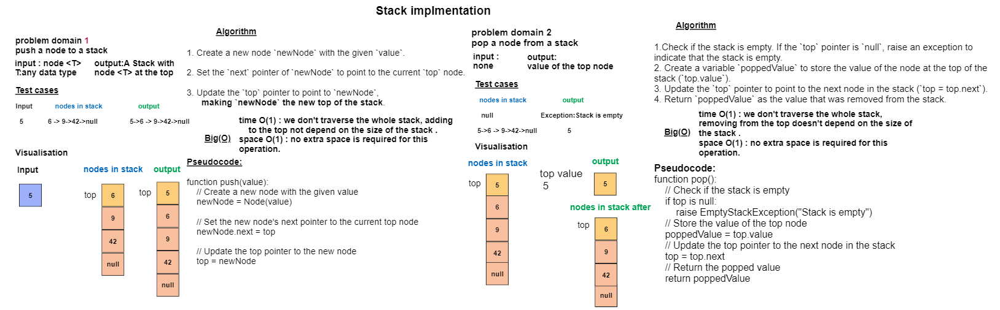

## Code Challenge 10: Stack-Implmentation
### Implment a Stack data structure class 
## Whiteboard Process


## Approach & Efficiency
## there are 2 main methods 
### 1. push(T value) : Adds a new node with the given value to the top of the stack. 
**Algorithm :**
1. Create a new node `newNode` with the given `value`.

2. Set the `next` pointer of `newNode` to point to the current `top` node.

3. Update the `top` pointer to point to `newNode`,
**Time Complexity:** O(1)
- The `push` method inserts a new element (node) at the top of the stack.
- Regardless of the number of elements currently in the stack, the `push` operation takes a constant amount of time because it involves creating a new node, setting its `next` reference to the current top, and updating the `top` reference to the new node.

**Space Complexity:** O(1)
- The `push` method uses a constant amount of additional memory regardless of the size of the stack.
- It creates a single new node for the element being pushed, and the memory usage does not depend on the number of elements already in the stack.
### 2. pop() : Removes and returns the value from the node at the top of the stack.
**Algorithm :**
1. Check if the stack is empty. If the `top` pointer is `null`, raise an exception to indicate that the stack is empty.
2. Create a variable `poppedValue` to store the value of the node at the top of the stack (`top.value`).
3. Update the `top` pointer to point to the next node in the stack (`top = top.next`).
4. Return `poppedValue` as the value that was removed from the stack.

**Time Complexity:** O(1)
- The `pop` method removes the top element (node) from the stack.
- Regardless of the number of elements currently in the stack, the `pop` operation takes a constant amount of time because it involves updating the `top` reference to point to the next node.
- The time complexity is not dependent on the size of the stack.

**Space Complexity:** O(1)
- The `pop` method uses a constant amount of additional memory regardless of the size of the stack.
- It does not create new data structures or allocate additional memory that scales with the number of elements in the stack.
- The space complexity is constant.

## Solution
``` java 
package stack;

public class Stack <T>{
public Node <T> top;

        public Stack() {
            this.top = null;
        }

        public void push(T value) {
            Node<T> newNode = new Node<>(value);
            newNode.next = top;
            top = newNode;
        }

        public T pop() {
            if (isEmpty()) {
                throw new IllegalStateException("Stack is empty");
            }
            T value = top.value;
            top = top.next;
            return value;
        }

        public T peek() {
            if (isEmpty()) {
                throw new IllegalStateException("Stack is empty");
            }
            return top.value;
        }

        public boolean isEmpty() {
            return top == null;
        }
    }


``` 
# Tests
``` java
class StackTest {

    @Test
    void testPush() {
        Stack<Integer> stack = new Stack<>();
        stack.push(5);

        assertFalse(stack.isEmpty());
        assertEquals(5, stack.peek());
    }

    @Test
    void testPushMultipleValues() {
        Stack<String> stack = new Stack<>();
        stack.push("apple");
        stack.push("banana");
        stack.push("cherry");

        assertFalse(stack.isEmpty());
        assertEquals("cherry", stack.peek());
    }

    @Test
    void testPop() {
        Stack<Double> stack = new Stack<>();
        stack.push(3.14);
        double poppedValue = stack.pop();

        assertTrue(stack.isEmpty());
        assertEquals(3.14, poppedValue);
    }

    @Test
    void testEmptyStackAfterMultiplePops() {
        Stack<Character> stack = new Stack<>();
        stack.push('a');
        stack.push('b');
        stack.push('c');
        stack.pop();
        stack.pop();
        stack.pop();

        assertTrue(stack.isEmpty());
        assertThrows(IllegalStateException.class, stack::pop);
    }

    @Test
    void testPeek() {
        Stack<String> stack = new Stack<>();
        stack.push("one");
        stack.push("two");
        stack.push("three");

        assertEquals("three", stack.peek());
        assertFalse(stack.isEmpty());
    }

    @Test
    void testInstantiateEmptyStack() {
        Stack<Integer> stack = new Stack<>();

        assertTrue(stack.isEmpty());
    }
```