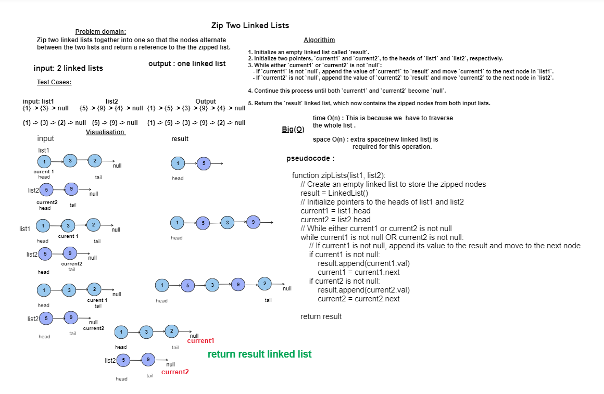

## Code Challenge08: Zip the two linked lists
### Zip the two linked lists together into one so that the nodes alternate between the two lists and return a reference to the the zipped list.
## Whiteboard Process


## Approach & Efficiency
- The zipLists method involves iterating through both input linked lists (list1 and list2) alternately and creating a new linked list (result) by appending nodes from each list.
- In summary:
- Time Complexity: O(n + m)
- Space Complexity: O(n)
- Let's analyze and underatand why its time complexity and space complexity:
### Time Complexity:
- The method iterates through both `list1` and `list2` sequentially, considering each node exactly once.
- Since each iteration involves constant time operations (appending to the result list), the time complexity is proportional to the combined length of `list1` and `list2`.
- Therefore, the time complexity can be expressed as O(n + m), where n is the length of `list1` and m is the length of `list2`.

### Space Complexity:
- The method creates a new linked list `result` to store the zipped elements.
- The additional space used is proportional to the total number of nodes in the `result` list.
- In the worst case, if both `list1` and `list2` have n nodes each, the `result` list will have 2n nodes.
- Thus, the space complexity is O(n), where n is the total number of nodes in the zipped list.

## Solution
``` java 
package linked.list;

public class LinkedList {
    public class Node {
        int val;
        Node next;

        Node(int val) {
            this.val = val;
        }
    }

    private Node head = null;
    private Node tail = null;


    private boolean isEmpty() {
        return (head == null);
    }

    void insert(int val) {
        if (isEmpty()) {
            head = new Node(val);
            tail = head;

        } else {
            Node newNode = new Node(val);
            newNode.next = head;
            head = newNode;

        }

    }
     public void append(int val){
        if (isEmpty()){
            insert(val);
        }else {
            Node newNode=new Node(val);
            tail.next=newNode;
            newNode.next=null;
            tail=newNode; }
    } 
     public LinkedList zipLists(LinkedList list1, LinkedList list2) {
        LinkedList result = new LinkedList();

        Node current1 = list1.head;
        Node current2 = list2.head;

        while (current1 != null || current2 != null) {
            if (current1 != null) {
                result.append(current1.val);
                current1 = current1.next;
            }

            if (current2 != null) {
                result.append(current2.val);
                current2 = current2.next;
            }
        }

        return result;
    }
    @Override
    public String toString() {
        String print = "";
        if (isEmpty()) {
            print="linked list is empty!!";

        } else {
            Node temp = head;

            while (temp != null) {

                print += temp.val;
                print += " -> ";
                temp = temp.next;
            }
            print += "NULL";

        }

        return print;
    }
}

``` 
# Tests
``` java
public class LinkedListTest {

     @Test
    void testZipLists() {
        LinkedList list1 = new LinkedList();
        list1.insert(1);
        list1.insert(3);
        list1.insert(5);

        LinkedList list2 = new LinkedList();
        list2.insert(2);
        list2.insert(4);
        list2.insert(6);

        LinkedList result = new LinkedList();
        result = result.zipLists(list1, list2);

        assertEquals("5 -> 6 -> 3 -> 4 -> 1 -> 2 -> NULL", result.toString());
    }
```