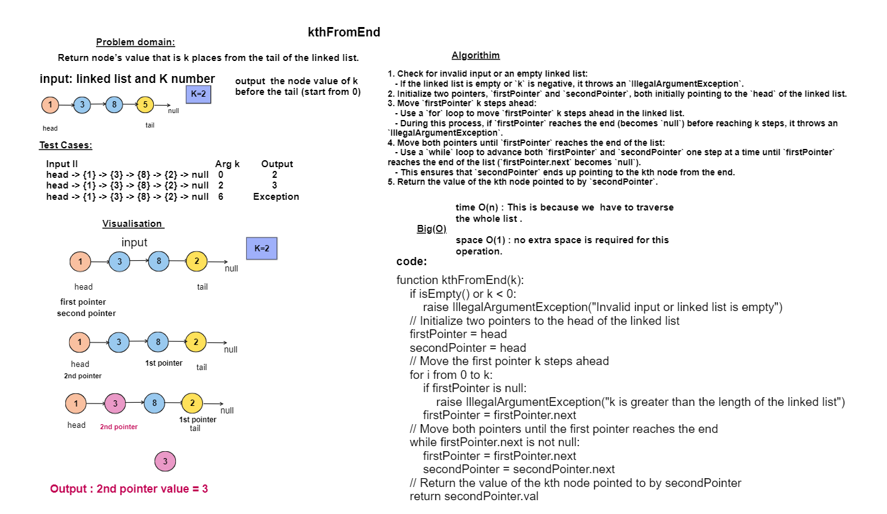

## Code Challenge 07: linked-list-kth
### Return the node’s value that is k -a number- places from the tail of the linked list.

## Whiteboard Process
 

## Approach & Efficiency
**Algorithm Description:**

This algorithm finds the kth node from the end of a singly linked list, where the linked list is implemented as part of the `LinkedList` class. The algorithm works as follows:

1. Check for invalid input or an empty linked list:
    - If the linked list is empty or `k` is negative, it throws an `IllegalArgumentException`.

2. Initialize two pointers, `firstPointer` and `secondPointer`, both initially pointing to the `head` of the linked list.

3. Move `firstPointer` k steps ahead:
    - Use a `for` loop to move `firstPointer` k steps ahead in the linked list.
    - During this process, if `firstPointer` reaches the end (becomes `null`) before reaching k steps, it throws an `IllegalArgumentException`.

4. Move both pointers until `firstPointer` reaches the end of the list:
    - Use a `while` loop to advance both `firstPointer` and `secondPointer` one step at a time until `firstPointer` reaches the end of the list (`firstPointer.next` becomes `null`).
    - This ensures that `secondPointer` ends up pointing to the kth node from the end.

5. Return the value of the kth node pointed to by `secondPointer`.

### Time Complexity:
- The algorithm iterates through the linked list twice: once to move `firstPointer` k steps ahead and once to move both pointers to the end.
- The time complexity is O(n), where n is the number of nodes in the linked list.

### Space Complexity:
- The algorithm uses a constant amount of additional space, regardless of the size of the linked list.
- The space complexity is O(1), indicating constant space usage.


## Solution
``` java 
package linked.list;

public class LinkedList {
    public class Node {
        int val;
        Node next;

        Node(int val) {
            this.val = val;
        }
    }

    private Node head = null;


    private boolean isEmpty() {
        return (head == null);
    }

     public int kthFromEnd(int k) {
        if (isEmpty() || k < 0) {
            throw new IllegalArgumentException("Invalid input or linked list is empty");
        }

        Node firstPointer = head;
        Node secondPointer = head;

        // Move the first pointer k steps ahead
        for (int i = 0; i < k; i++) {
            if (firstPointer == null) {
                throw new IllegalArgumentException("k is greater than the length of the linked list");
            }
            firstPointer = firstPointer.next;
        }

        // Handle the case where k is equal to the length of the list
        if (firstPointer == null) {
            throw new IllegalArgumentException("k is equal to the length of the linked list");
        }

        // Move both pointers until the first pointer reaches the end
        while (firstPointer.next != null) {
            firstPointer = firstPointer.next;
            secondPointer = secondPointer.next;
        }

        return secondPointer.val;
    }

    @Override
    public String toString() {
        String print = "";
        if (isEmpty()) {
            print="linked list is empty!!";

        } else {
            Node temp = head;

            while (temp != null) {

                print += temp.val;
                print += " -> ";
                temp = temp.next;
            }
            print += "NULL";

        }

        return print;
    }
}

``` 
# Tests
``` java
public class LinkedListTest {
  @Test
    void testKthFromEndWhereKGreaterThanListLength() {
        LinkedList list = new LinkedList();
        list.insert(5);
        list.insert(10);
        list.insert(15);

        assertThrows(IllegalArgumentException.class, () -> list.kthFromEnd(5));
    }

    @Test
    void testKthFromEndWhereKAndListLengthAreSame() {
        LinkedList list = new LinkedList();
        list.insert(5);
        list.insert(10);
        list.insert(15);

        assertThrows(IllegalArgumentException.class, () -> list.kthFromEnd(3));
    }

    @Test
    void testKthFromEndWhereKNegative() {
        LinkedList list = new LinkedList();
        list.insert(5);
        list.insert(10);
        list.insert(15);

        assertThrows(IllegalArgumentException.class, () -> list.kthFromEnd(-2));
    }

    @Test
    void testKthFromEndWhereListSizeIs1() {
        LinkedList list = new LinkedList();
        list.insert(5);

        assertEquals(5, list.kthFromEnd(0));
    }

    @Test
    void testKthFromEndHappyPath() {
        LinkedList list = new LinkedList();
        list.insert(5);
        list.insert(10);
        list.insert(15);

        assertEquals(10, list.kthFromEnd(1));
    }
  
}
```