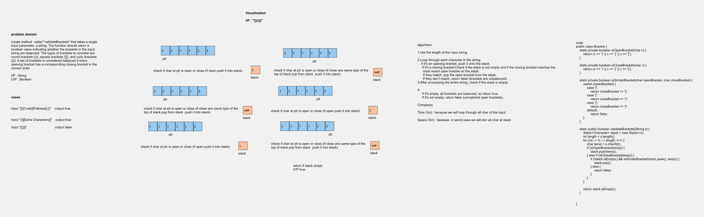

## Code Challenge 13:validateBrackets
create method  called "validateBrackets" that takes a single input parameter, a string. The function should return a boolean value indicating whether the brackets in the input string are balanced. The types of brackets to consider are round brackets (()), square brackets ([]), and curly brackets ({}). A set of brackets is considered balanced if every opening bracket has a corresponding closing bracket in the correct order.
## Whiteboard Process


## Approach & Efficiency 
**Algorithm :**
1. Get the length of the input string.

2. Loop through each character in the string:
    - If it's an opening bracket, push it onto the stack.
    - If it's a closing bracket:
        - Check if the stack is not empty and if the closing bracket matches the most recent open bracket on the stack.
        - If they match, pop the open bracket from the stack.
        - If they don't match, return false (brackets are unbalanced).

3. After processing the entire string, check if the stack is empty:
    - If it's empty, all brackets are balanced, so return true.
    - If it's not empty, return false (unmatched open brackets).

**Time Complexity:** O(n)
- because we need to iterate through the String sentence.
**Space Complexity:** O(n)

## Solution
``` java 
public Stack <Character>brackets = new Stack<>();

    public Validatebrackets() {
    }

    public boolean validateBrackets(String sentece) {

        for (int i = 0; i < sentece.length(); i++) {
            if (isOpenBracket(sentece.charAt(i))) {
                brackets.push(sentece.charAt(i));
            } else if (isClosedBracket(sentece.charAt(i))) {
                if(!brackets.isEmpty()&&matched(brackets.peek(),sentece.charAt(i))){
                    brackets.pop();
                }else return false;
            }
        }
    return brackets.isEmpty();}


    public boolean isOpenBracket(char ch) {
        if (ch == '(' || ch == '[' || ch == '{')
            return true;
        return false;
    }

    public boolean isClosedBracket(char ch) {
        if (ch == ')' || ch == ']' || ch == '}')
            return true;
        return false;
    }

    public boolean matched(char ch1, char ch2) {
        if (ch1=='(' && ch2==')')
            return true;
        else if (ch1=='{' && ch2=='}')
            return true;
        else if (ch1=='[' && ch2==']')
            return true;
        return false;
    }
}


``` 
# Tests
``` java
public class ValidateBracketsTest{
    @Test
    void testValidBrackets() {
        Validatebrackets validator = new Validatebrackets();

        assertTrue(validator.validateBrackets("{}"));
        assertTrue(validator.validateBrackets("{}(){}"));
        assertTrue(validator.validateBrackets("()[[Extra Characters]]"));
        assertTrue(validator.validateBrackets("(){}[[]]"));
        assertTrue(validator.validateBrackets("{}{Code}[Fellows](())"));
    }

    @Test
    void testInvalidBrackets() {
        Validatebrackets validator = new Validatebrackets();

        assertFalse(validator.validateBrackets("[({}]"));
        assertFalse(validator.validateBrackets("(]"));
        assertFalse(validator.validateBrackets("{(})"));
    }

    @Test
    void testEmptyString() {
        Validatebrackets validator = new Validatebrackets();

        assertTrue(validator.validateBrackets(""));
    }

    @Test
    void testOnlyOpeningBrackets() {
        Validatebrackets validator = new Validatebrackets();

        assertFalse(validator.validateBrackets("{[("));
    }

    @Test
    void testOnlyClosingBrackets() {
        Validatebrackets validator = new Validatebrackets();

        assertFalse(validator.validateBrackets("})]"));
    }

    @Test
    void testMixedBrackets() {
        Validatebrackets validator = new Validatebrackets();

        assertFalse(validator.validateBrackets("{[)]"));
    }


}

```