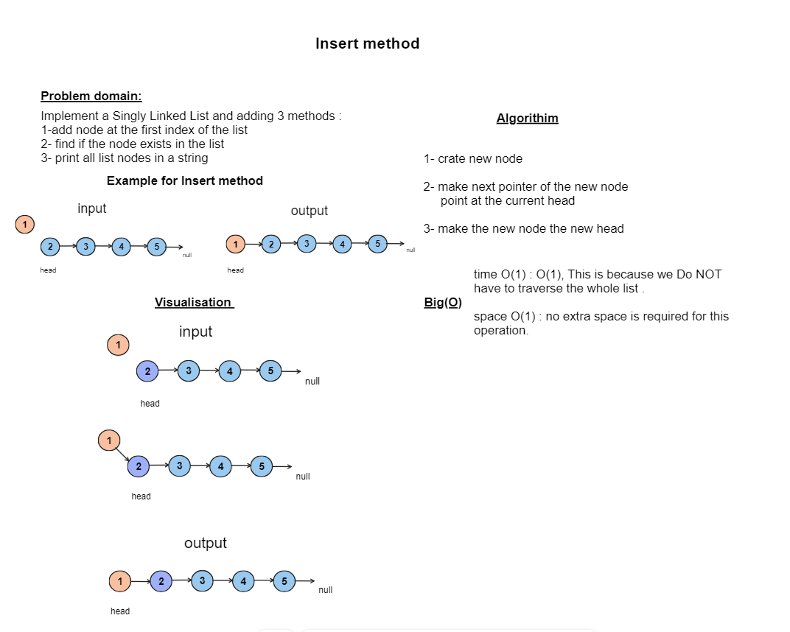

## Code Challenge: Class 05: linked-list 
### Implement a Singly Linked List and adding 3 methods
- add node at the first index of the list
- find if the node exists in the list
- print all list nodes in a string
## Whiteboard Process


## Approach & Efficiency
## approach for insertion
- Create a Node: Initialize a new node with the desired data value.

- Adjust New Node's Next Pointer: Set the next pointer of the new node to point to the current head of the linked list. This step ensures that the new node is linked to the existing list.

- Update Head Pointer: Update the head pointer of the linked list to reference the new node. This effectively designates the new node as the new head of the list.

- Finalization: The new node is now successfully inserted at the head of the linked list, and the head pointer points to it. The other elements in the linked list can be accessed by following the next pointers.
### Time Complexity:
The time complexity of this approach is O(1), This is because we **Do NOT have to traverse the whole list** .

### Space Complexity:
The space complexity is also O(1) since **no extra space is required for this operation** .

## Solution
``` java 
package linked.list;

public class LinkedList {
    public class Node {
        int val;
        Node next;

        Node(int val) {
            this.val = val;
        }
    }

    private Node head = null;


    private boolean isEmpty() {
        return (head == null);
    }

    void insert(int val) {
        if (isEmpty()) {
            head = new Node(val);
//            tail = head;

        } else {
            Node newNode = new Node(val);
            newNode.next = head;
            head = newNode;

        }

    }
    boolean Includes(int val) {
        Node temp=head;
        while (temp != null) {

            if(temp.val==val)return true;

            temp = temp.next;
        }

        return false;
    }

    @Override
    public String toString() {
        String print = "";
        if (isEmpty()) {
            print="linked list is empty!!";

        } else {
            Node temp = head;

            while (temp != null) {

                print += temp.val;
                print += " -> ";
                temp = temp.next;
            }
            print += "NULL";

        }

        return print;
    }
}

``` 
# Tests 
``` java
ublic class LinkedListTest {

    @Test
    void testInsertAndToString() {
        LinkedList linkedList = new LinkedList();
        linkedList.insert(30);
        linkedList.insert(99);
        linkedList.insert(10);

        assertEquals("10 -> 99 -> 30 -> NULL", linkedList.toString());
    }
    @Test
    void testInsertAndToStringIfLinkedListIsEmpity () {
        LinkedList linkedList = new LinkedList();
        assertEquals("linked list is empty!!", linkedList.toString());

    }

    @Test
    void testIncludes() {
        LinkedList linkedList = new LinkedList();
        linkedList.insert(2000);
        linkedList.insert(152);
        linkedList.insert(10);

        assertTrue(linkedList.Includes(10));
        assertFalse(linkedList.Includes(1611));
    }
}
```