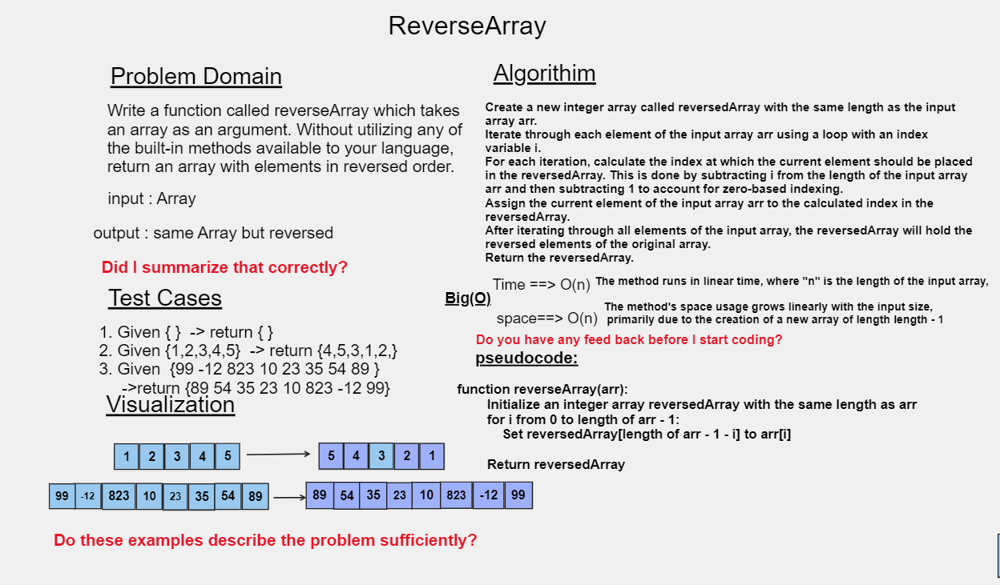

# Code Challenge: Class 01
#### Write a function called reverseArray which takes an array as an argument and returns an array with elements in reversed order. 
## Whiteboard Process


## Approach & Efficiency
I used a basic approach to reverse the array by creating a new array and copying elements from the original array in reverse order.

### Time Complexity:
The time complexity of this approach is O(n), where "n" is the number of elements in the array. This is because the algorithm loops through each element once to copy it to the reversed array.

### Space Complexity:
The space complexity is also O(n) since we use extra memory to store the new reversed array. The memory usage increases proportionally with the number of elements in the input array.

### Considerations:
While this method is simple to understand and implement, it does require additional memory to store the reversed array. If memory usage is a concern, an in-place reversal algorithm that operates directly on the input array without using extra memory would be a more memory-efficient solution.

## Solution 
``` java 
public class arrayreverse {
    public static int[] reverseArray(int[] arr) {
        int[] reversedArray = new int[arr.length];
        
        for (int i = 0; i < arr.length; i++) {
            reversedArray[arr.length - 1 - i] = arr[i];
        }
        
        return reversedArray;
    }

    public static void main(String[] args) {
        int[] originalArray = {1, 2, 3, 4, 5};
        int[] reversedArray = reverseArray(originalArray);
        
        System.out.print("Original array: ");
        for (int num : originalArray) {
            System.out.print(num + " ");
        }
        
        System.out.print("\nReversed array: ");
        for (int num : reversedArray) {
            System.out.print(num + " ");
        }
    }
}
```
