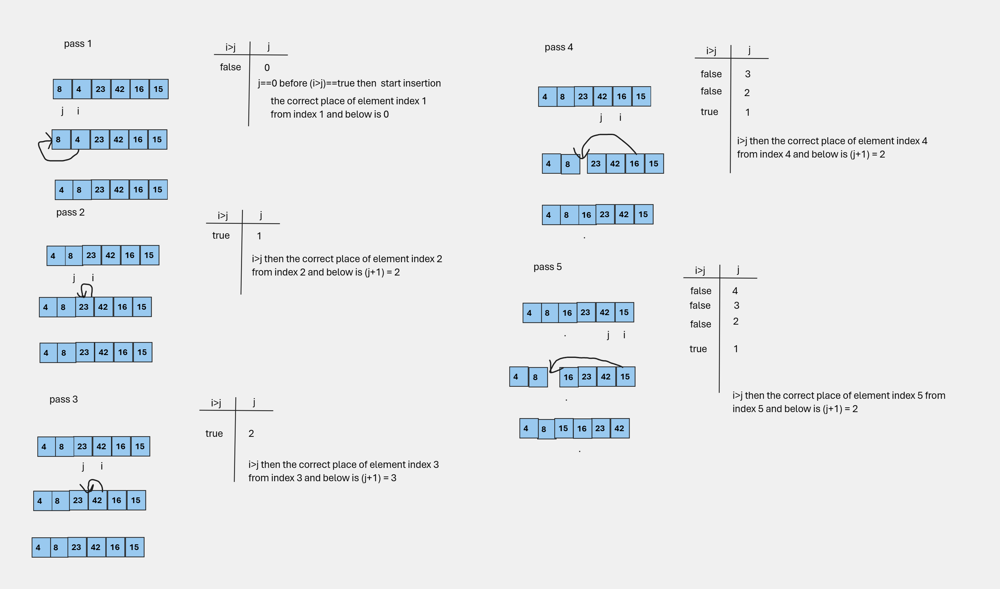
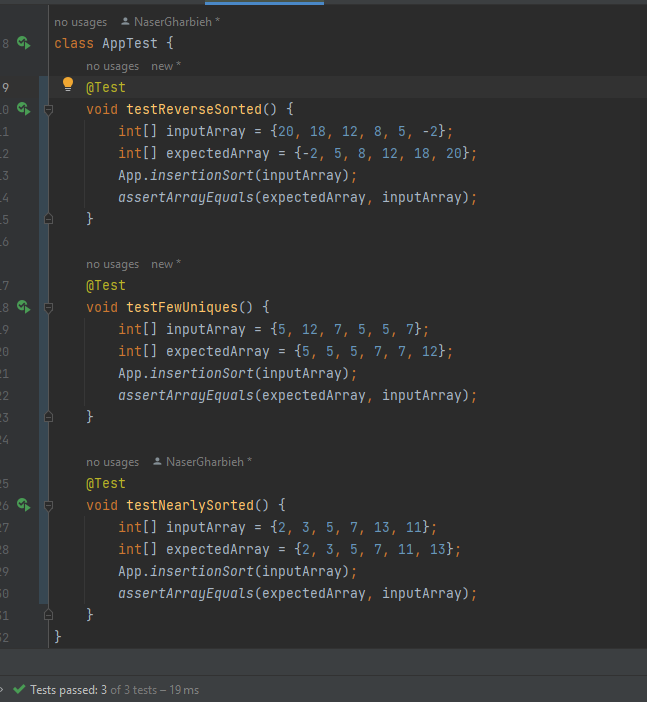

# Insertion sort
## What is Insertion Sort?

Insertion Sort is a straightforward comparison-based sorting algorithm that builds the final sorted array one item at a time. It is much like organizing a deck of playing cards in your hand, where you pick a card and insert it into its correct position among the already sorted cards.

The key idea behind Insertion Sort is to divide the input array into two parts: the sorted part and the unsorted part. The algorithm iterates through the unsorted part, selects one element at a time, and inserts it into its proper place in the sorted part. This process continues until the entire array is sorted.

## How Does Insertion Sort Work?

Here's a step-by-step explanation of how Insertion Sort works:

1. Start with the second element (index 1) in the array. This is the first element in the "unsorted" part of the array. The first element (index 0) is considered the "sorted" part.

2. Compare this element to the one before it (in the sorted part). If it's smaller, swap them; otherwise, leave it in place.

3. Move on to the next element in the unsorted part and repeat step 2 until you reach the end of the array.

4. By the end of this process, the sorted part of the array will grow, and the unsorted part will shrink, until the entire array is sorted.

5. Continue this process until all elements are in their correct positions.

Here's a simple implementation of Insertion Sort in Java:

```java
private static void insertionSort(int[] arr) {
    for (int i = 1; i < arr.length; i++) {
        int temp = arr[i];
        int j = i - 1;
        while (j >= 0 && arr[j] > temp) {
            arr[j + 1] = arr[j];
            j--;
        }
        arr[j + 1] = temp;
    }
}
```
# Tracing Process
let's trace the insertion sort algorithm step by step with the sample array [8, 4, 23, 42, 16, 15]:
 

**Initial Array:** [8, 4, 23, 42, 16, 15]

**Pass 1:**
- `i` is 1, so we take `temp = 4` and `j = 0`.
- Since 8 is greater than 4, we shift 8 to the right, and the array becomes [8, 8, 23, 42, 16, 15].
- We continue to move left, and when `j` becomes -1, we stop.
- Now, we insert `temp` (4) into the correct position, so the array becomes [4, 8, 23, 42, 16, 15].

**Pass 2:**
- `i` is 2, so we take `temp = 23` and `j = 1`.
- 8 is not greater than 23, so we don't enter the while loop.
- We insert `temp` into its correct position, so the array remains the same: [4, 8, 23, 42, 16, 15].

**Pass 3:**
- `i` is 3, so we take `temp = 42` and `j = 2`.
- 23 is not greater than 42, so we don't enter the while loop.
- We insert `temp` into its correct position, so the array remains the same: [4, 8, 23, 42, 16, 15].

**Pass 4:**
- `i` is 4, so we take `temp = 16` and `j = 3`.
- 42 is greater than 16, so we shift 42 to the right, and the array becomes [4, 8, 23, 42, 42, 15].
- We continue to move left, and when `j` becomes 2, we stop.
- Now, we insert `temp` (16) into its correct position, so the array becomes [4, 8, 23, 16, 42, 15].

**Pass 5:**
- `i` is 5, so we take `temp = 15` and `j = 4`.
- 42 is greater than 15, so we shift 42 to the right, and the array becomes [4, 8, 23, 16, 42, 42].
- We continue to move left, and when `j` becomes 3, we stop.
- Now, we insert `temp` (15) into its correct position, so the array becomes [4, 8, 23, 15, 16, 42].

After all passes, the array is fully sorted: [4, 8, 15, 16, 23, 42].
## Efficiency of Insertion Sort

Insertion Sort is not the most efficient sorting algorithm, particularly for large datasets, but it has its strengths:

- **Time Complexity:** In the worst-case scenario, Insertion Sort has a time complexity of O(n^2), where n is the number of elements in the array. This means it can be slow for large arrays. However, for small arrays or nearly sorted arrays, it can be quite fast.

- **Space Complexity:** Insertion Sort is an in-place sorting algorithm, which means it doesn't require additional memory to sort the array. Its space complexity is O(1).
## Testing 


## Use Cases

Insertion Sort can be a good choice when:

- You have a small dataset to sort.
- The array is nearly sorted, as Insertion Sort performs well in this scenario.
- You need a simple and easy-to-understand sorting algorithm for educational purposes or small-scale applications.

However, for larger datasets, more efficient sorting algorithms like Merge Sort, Quick Sort, or even built-in sorting functions provided by programming languages are often preferred.

In conclusion, Insertion Sort is a basic and intuitive sorting algorithm that is easy to implement and understand. While it may not be the most efficient sorting method for all cases, it has its place in certain scenarios where simplicity and stability are more important than raw speed.

---