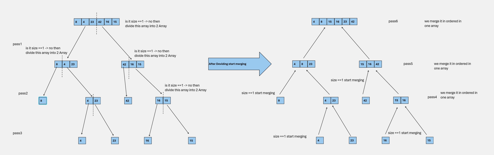
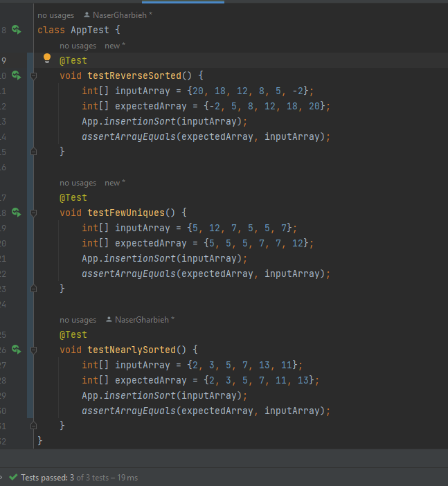

# Merge Sort
## What is Merge Sort?

Merge Sort is a divide-and-conquer sorting algorithm that breaks down an array into smaller sub-arrays until each sub-array contains a single element. It then merges these sub-arrays to create a sorted array. Think of it as breaking a problem into smaller pieces, solving each piece, and then combining the solutions.

The key idea behind Merge Sort is to repeatedly divide the array in half until we have sub-arrays of one or two elements. Then, we merge these smaller sub-arrays back together in a sorted manner.

## How Does Merge Sort Work?

Here's a step-by-step explanation of how Merge Sort works:

1. Divide the array into two halves.
2. Recursively apply Merge Sort to each half until each sub-array contains one or two elements (base case).
3. Merge the two sorted sub-arrays into one sorted array.

Here's a simple implementation of Merge Sort in Java:

```java
 public static void mergeSort(int [] arr){
        int n = arr.length;
        if(n <2){
        return;
        }

        int mid = n /2;
        int [] left = new int[mid];
        int [] right = new int[n - mid];
        for (int i = 0; i < mid; i++) {
        left[i]= arr[i];
        }
        for (int i = mid; i < n; i++) {
        right[i-mid]= arr[i];
        }

        mergeSort(left);
        mergeSort(right);
        merge(left,right, arr);

        }

public static void merge(int [] left,int [] right,int [] arr){
        int i =0, j=0, k=0;
        while (i < left.length && j< right.length) {
        if(left[i]<=right[j]) {
        arr[k]=left[i];
        i++;
        } else {
        arr[k]=right[j];
        j++;
        }

        k++;
        }

        while (i< left.length){
        arr[k]=left[i];
        i++;
        k++;
        }
        while (j< right.length){
        arr[k]=right[j];
        j++;
        k++;
        }

        
```

# Tracing Process
Let's trace the Merge Sort algorithm step by step with the sample array [8, 4, 23, 42, 16, 15]:



| **Step** | **Left Sub-array** | **Right Sub-array** | **Merge Step** | **Result** |
|---------|-------------------|--------------------|---------------|------------|
| Initial | [8, 4, 23]        | [42, 16, 15]       |               | [8, 4, 23, 42, 16, 15] |
| 1       | [8]               | [4, 23]            |               | [8, 4, 23, 42, 16, 15] |
| 1.1     |                   |                    | [4, 8, 23]    | [4, 8, 23, 42, 16, 15] |
| 1.2     | [16]              | [15]               |               | [16, 15]           |
| 1.2.1   |                   |                    | [15, 16]      | [16, 15]           |
| 1.3     |                   |                    | [4, 8, 15, 16, 23] | [4, 8, 15, 16, 23, 42] |


## Efficiency of Merge Sort

Merge Sort is known for its efficiency and consistency in terms of time complexity:

- **Time Complexity:** Merge Sort has a consistent time complexity of O(n log n), making it efficient for large datasets. It divides the array into smaller parts and recursively merges them.

- **Space Complexity:** Merge Sort uses additional memory for the temporary sub-arrays, resulting in a space complexity of O(n). However, this extra space ensures stability and predictability in performance.

# Testing


## Use Cases

Merge Sort is an excellent choice for sorting when:

- You need a stable sorting algorithm (preserves the order of equal elements).
- You have a large dataset or a dataset with a consistent time complexity requirement.
- Predictable and efficient sorting is more important than low memory usage.

In conclusion, Merge Sort is a highly efficient and stable sorting algorithm that consistently performs well for large datasets. While it does require additional memory due to its divide-and-conquer approach, its reliable and consistent time complexity makes it a popular choice in many applications.
